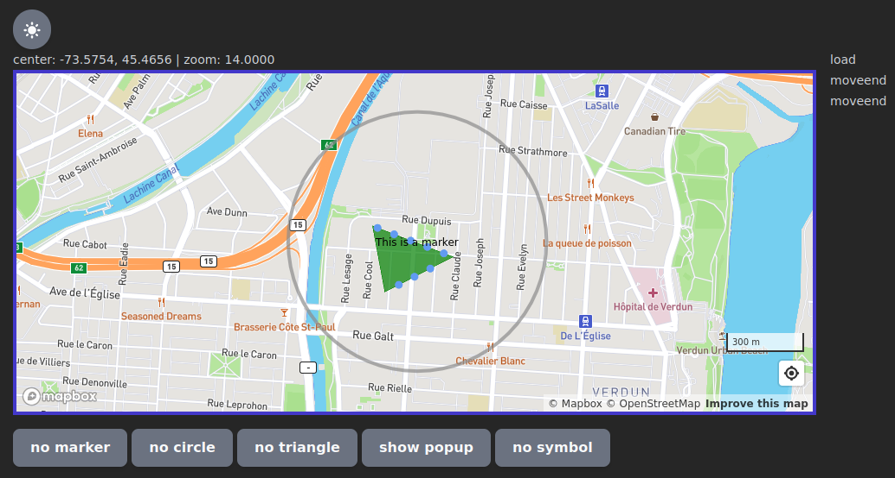

## react-mapbox

**react-mapbox** is a very minimalist React.js wrapper library for the 
[Mapbox GL JS](https://docs.mapbox.com/mapbox-gl-js/guides/) 
Typescript library.

Example
-------
There is a folder called `test` which contains a very simple test 
application, which also serves as an example of how to use the library. 
The `package.json` (of the test app) causes symlinks to be created for 
the react dependencies and the `react-mapbox` library itself. This 
means that the test application can be used to test changes to the 
library immediately without having to do `npm publish` or `npm pack`, 
and then `npm install` over and over. `npm install` only needs to be 
typed once for it to work. The test app exercises many of 
the features of the library in a very simple way. Here is a screenshot.

For the test app to work, you need to create a `.env` file in the 
`test` folder with your Mapbox API key as follows:

```
REACT_APP_MAPBOX_API_KEY=<Mapbox API key>
```

You also need to type `npm i` just once in the `test` folder. For 
subsequent changes to library code, just refresh the browser.

Here is how the test app should appear.


